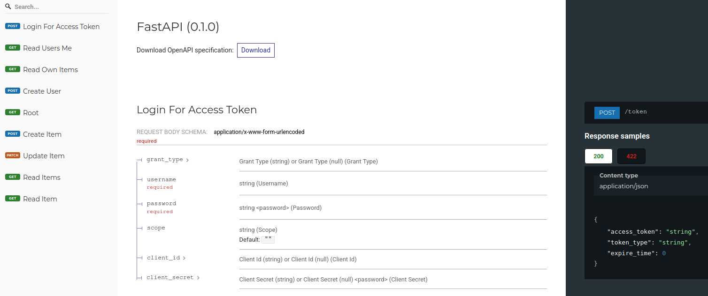
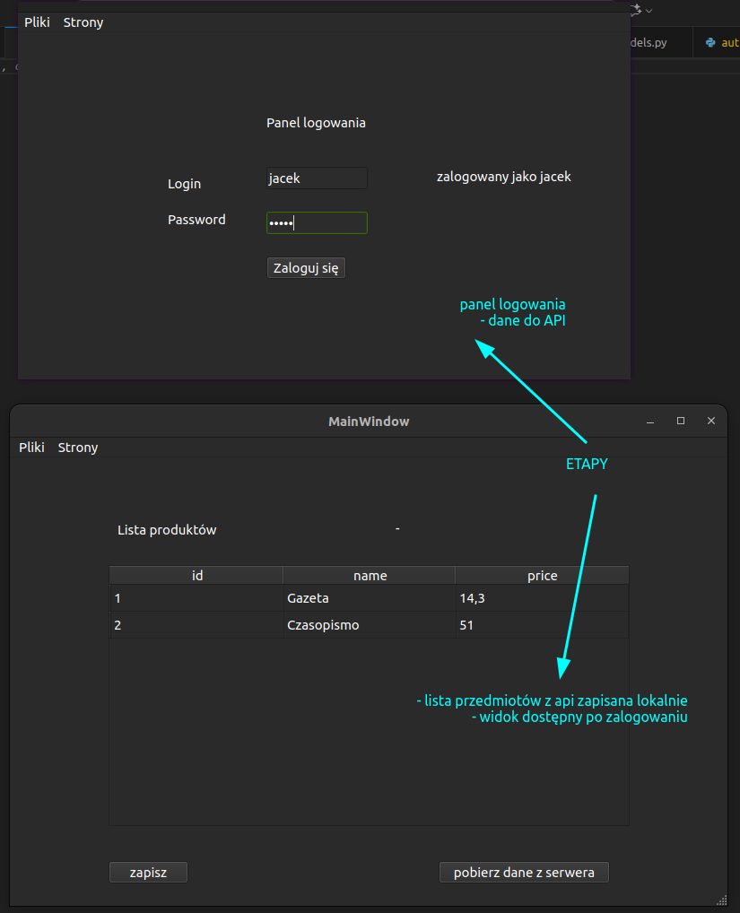

# Aplikacja desktop + Api -- Python

Aplikacja desktop pozwala na logowanie do api oraz pobieranie i edycje przedmiotów i przesyłania zmian na serwer.




### Wymagane

* python 3
* pip


### Tworzenie środowiska

```
cd fast_api/
python -m venv env

cd serwisant/
python -m venv env
```


